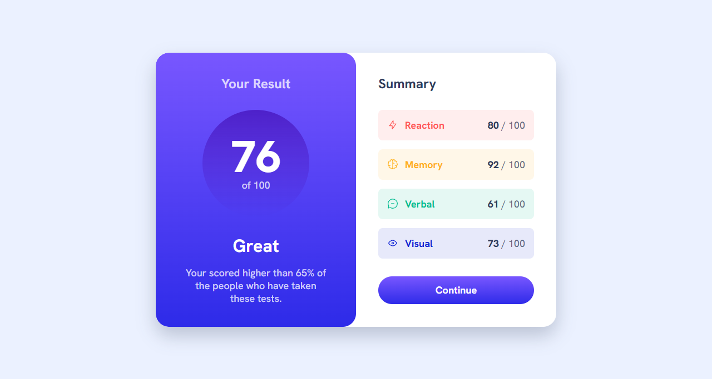
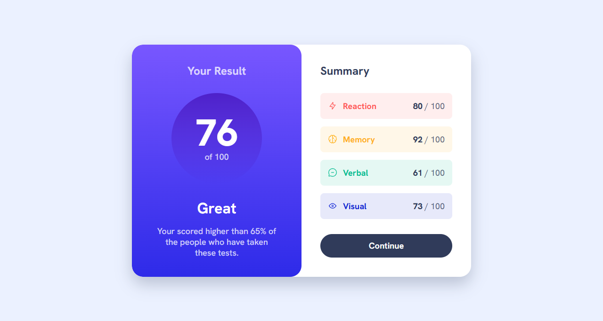
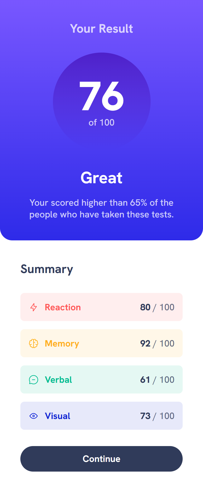

# Frontend Mentor - Results Summary Component

Solution to the [Results summary component challenge](https://www.frontendmentor.io/challenges/results-summary-component-CE_K6s0maV).

## Overview

### Screenshot
;
;
;

### Links
- Solution URL: [Add here]
- Live Site URL: [Add here]

## My process

### Built with
- Semantic HTML5
- CSS custom properties
- CSS Grid & Flexbox
- CSS @layer architecture
- Local @font-face (Hanken Grotesk variable font)
- Mobile-first workflow

### What I learned

Using HSL raw values as CSS variables enables alpha
compositing without extra variables:

```css
color: hsl(var(--clr-primary-hsl-100), .75);
```

The data-accent pattern with a local CSS variable
keeps all four summary item variants in one rule:

```css
.summary-item {
    background-color: hsl(var(--accent-color), .1);
}
.summary-item[data-accent="accent-1"] {
    --accent-color: var(--clr-accent-hsl-1);
}
```

### Continued development
- JavaScript — dynamically populating content from JSON
- More complex CSS animations

## Author
- Frontend Mentor - [@SaadArshad19se](https://www.frontendmentor.io/profile/SaadArshad19se)
- GitHub - [@SaadArshad19se](https://github.com/SaadArshad19se)